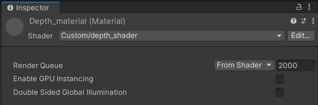
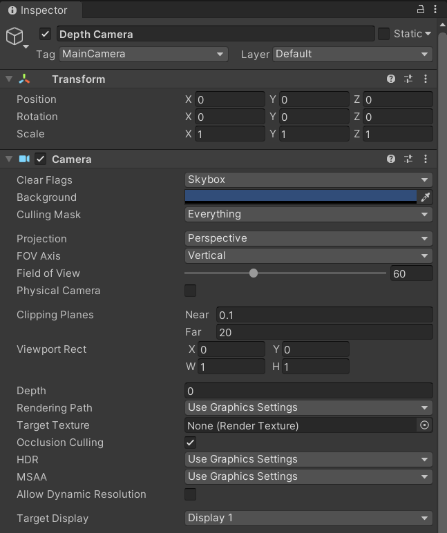

# Unity Depth Camera Implementation
## Installation and setting up scene
* Download and install Unity 2020+ (Probably it will work on other version too)
* Open Unity Hub and click on the **New project** tab. After that select **3D** project, name it and set your location. Notice that the proposed depth camera will not work for **HDRP** and **URP**
* In the Unity Editor you will see your new empty scene 
* Navigate to `Project` tab and create empty script there is desired folder. For example, create **Scripts** folder under **Assets** folder and create inside of it script by right clicking in empty space and then **Create** - **C# Script**. Name it **depth_script**. Then double click on it. Visual Studio will open
* Inside of it paste code from **depth_script.cs** file 
* Now in `Project` tab create **Material** by right clicking in empty space **Create** - **Material** (name it **depth_material**). Besides that you need to create shader by repeating the same procedure, but choose **Create** - **Shader** - **Standard Surface Shader** (name it **depth_shader**). CLick on shader object and in `Inspector` window click **Open**
* In opened **IDE** paste code from **depth_shader** file, save and close it
* Then navigate to your newly created material file (**depth_material** one) and next to Shader option choose **Custom/depth_shader**. It should look like this:

  

* Navigate to `Hierarchy` window and create new camera object (right click and **Camera**) by naming it **Depth Camera**. You can delete **Main Camera** object from `Hierarchy` or hide **Camera** script from this object
* You now need to add script to your **Depth Camera** object, which is called **depth_script**. Just click on **Depth Camera** game object and **Add Component*** from `Inspector`. In appeared list type **depth_script** and choose it
* Drag newly created material object from `Project` tab next to **Mat** in `Inspector` window
* In Depth Camera's **Camera** script, next to **Clipping Planes** set value for **Near and Far** as **0.1 and 20** respectively. For Depth choose **-1**. Your Camera script should look like this:

  

* Your depth camera is ready! Just add some object to your scene and press **Play** button. In game mode you can move your object and observe how depth camera is works!
